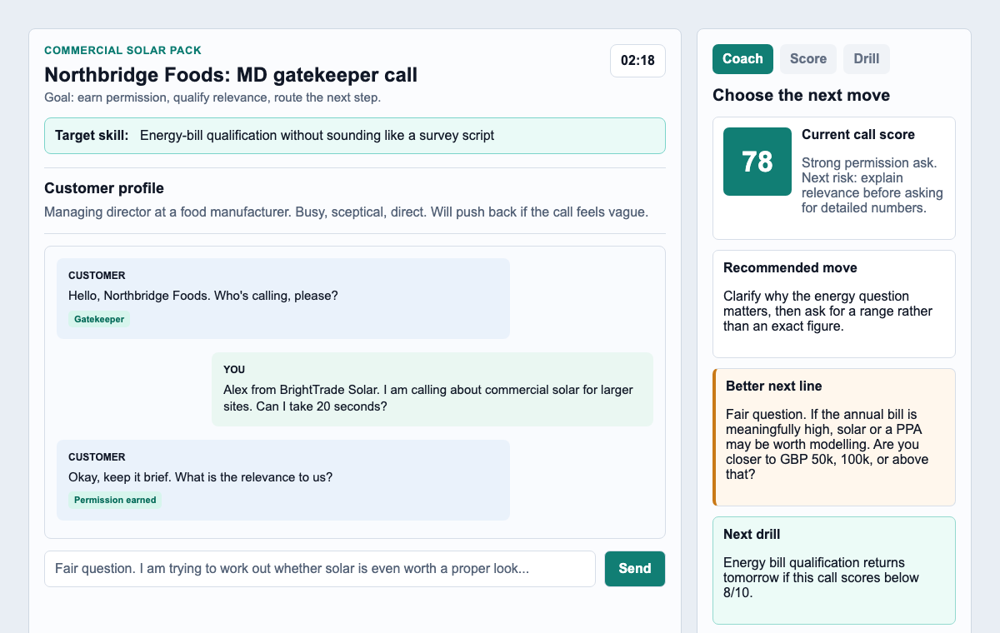

# Tradesites AI Sales Trainer

Free, open-source AI sales practice for contractors learning to win bigger commercial jobs.

[](#test-and-eval-commands)
[](LICENSE)

Tradesites AI Sales Trainer is a browser-based roleplay app. A rep speaks or types into a simulated customer call, receives realistic objections, can ask for coaching help, and gets a scored practice plan after the call.

Commercial solar is the first training pack because it has a hard real-world sales motion: cold outbound, gatekeepers, energy-cost discovery, landlord/tenant routing, PPA questions, procurement delays, and hard no responses. The same structure can be extended for roofers, electricians, HVAC teams, builders, and other trade businesses selling into larger commercial accounts.

Live demo: <https://trainer.tradesites.ai/>



## Status

This is an early alpha. It is usable for local practice and small controlled demos, but it is not a production dialer, CRM, or call-recording system.

The public demo requires login. For self-hosted public deployments, disable open signup unless you are ready to support unknown users.

## Features

- Public landing page plus authenticated trainer app.
- Typed input everywhere, with browser speech recognition and text-to-speech where supported.
- Scenario-based customer roleplay with stage-aware conversation guards.
- Commercial solar objection pack for larger business sales.
- Right-side Help panel that asks the rep to choose a move before revealing suggestions.
- Post-call scoring, missed opportunities, next drill assignment, and spaced repetition.
- Objection gauntlet mode for repeated high-pressure practice.
- Local review queue and approved response examples.
- Pluggable customer brain: deterministic mock, OpenClaw gateway, or local command provider.
- Local-first data storage with ignored transcript/profile/session files.

## Quick Start

Requirements:

- Node.js 20+
- npm

Run the app locally with the deterministic mock customer:

```bash
npm ci
npm test
AUTH_REQUIRED=0 npm start
```

Open <http://127.0.0.1:3137/>.

Chrome is the best browser for mic input because Web Speech API support varies by browser. Typed practice works without mic permissions.

## Login With PocketBase

The trainer requires login by default. For per-rep accounts, run PocketBase on loopback:

```bash
./pocketbase serve --http 127.0.0.1:8090
```

Then start the trainer in another terminal:

```bash
POCKETBASE_URL="http://127.0.0.1:8090" npm start
```

Open <http://127.0.0.1:3137/app> and sign in or create an account.

For shared or public deployments, create users manually in PocketBase and disable public signup:

```bash
SIGNUP_ENABLED=0 POCKETBASE_URL="http://127.0.0.1:8090" npm start
```

To let visitors request access without creating accounts immediately, use approval mode. Approval mode will not start unless public links, admin approval, and email delivery are configured:

```bash
SIGNUP_MODE=approval \
PUBLIC_BASE_URL="https://trainer.example.com" \
ACCESS_APPROVAL_TOKEN="replace-with-a-long-random-secret" \
TELEGRAM_BOT_TOKEN="replace-with-your-bot-token" \
TELEGRAM_CHAT_ID="replace-with-your-chat-id" \
BREVO_API_KEY="replace-with-your-brevo-api-key" \
MAIL_FROM="Tradesites AI Sales Trainer <trainer@example.com>" \
POCKETBASE_URL="http://127.0.0.1:8090" \
npm start
```

In approval mode, visitors enter only their email and click `Create Account`. The app sends a verification email. After the visitor verifies their email, Telegram receives an approval link. When you approve it, the app emails the visitor a password setup link. They set a password, then log in with email and password.

Validate the auth path:

```bash
TRAINER_URL="http://127.0.0.1:3137" \
POCKETBASE_URL="http://127.0.0.1:8090" \
npm run validate:auth
```

## Configuration

Copy `.env.example` for local notes. The app reads environment variables directly; it does not require dotenv.

| Variable | Default | Purpose |
| --- | --- | --- |
| `HOST` | `127.0.0.1` | Express bind host. Remote binding requires `ALLOW_REMOTE_UNSAFE=1`. |
| `PORT` | `3137` | Express port. |
| `DATA_DIR` | `data` | Local sessions, skill memory, profiles, and review queue. |
| `AUTH_REQUIRED` | `1` | Set `0` only for a private local demo. |
| `SIGNUP_MODE` | `disabled` | `disabled`, `approval`, or `open`. Approval mode requires admin approval before account creation. |
| `SIGNUP_ENABLED` | `0` | Set `1` only for local signup testing or intentional public registration. |
| `POCKETBASE_URL` | `http://127.0.0.1:8090` | PocketBase auth endpoint. |
| `PUBLIC_BASE_URL` | `http://127.0.0.1:3137` | Public URL used in verification, approval, and password setup links. |
| `ACCESS_APPROVAL_TOKEN` | empty | Required in approval mode. Server-side secret used to hash per-request admin approval tokens. |
| `BREVO_API_KEY` | empty | Preferred provider for approval-mode signup emails. Uses Brevo transactional email API. |
| `RESEND_API_KEY` | empty | Optional fallback provider for approval-mode signup emails. |
| `MAIL_FROM` | empty | Required in approval mode. Must be a verified sender address in Brevo or Resend. |
| `TELEGRAM_BOT_TOKEN` | empty | Optional bot token for verified-signup approval notifications. |
| `TELEGRAM_CHAT_ID` | empty | Optional chat id for verified-signup approval notifications. |
| `SIGNUP_EMAIL_TOKEN_TTL_HOURS` | `24` | Email verification link lifetime. |
| `SIGNUP_APPROVAL_TOKEN_TTL_HOURS` | `72` | Admin approval link lifetime. |
| `SIGNUP_PASSWORD_TOKEN_TTL_HOURS` | `24` | Password setup link lifetime. |
| `SIGNUP_EMAIL_RESEND_COOLDOWN_SECONDS` | `300` | Cooldown before a pending signup can resend/rotate a verification link. |
| `OPENCLAW_GATEWAY_URL` | empty | Optional WebSocket gateway for OpenClaw-backed customer replies. |
| `OPENCLAW_GATEWAY_TOKEN` | empty | Token for the OpenClaw gateway. |
| `OPENCLAW_AGENT_ID` | `main` | OpenClaw agent to run. |
| `CODEX_BRAIN_COMMAND` | empty | Optional local command that receives JSON and returns a customer reply. |
| `CODEX_MODEL` | provider-defined | Optional model hint used by `scripts/codex-brain.mjs`. |

## Customer Brain Options

Mock mode is the default and needs no API keys. It is deterministic, fast, and good for tests.

OpenClaw mode sends scenario and transcript context to an OpenClaw gateway:

```bash
OPENCLAW_GATEWAY_URL="ws://127.0.0.1:18789" \
OPENCLAW_GATEWAY_TOKEN="your-token" \
npm start
```

Command mode lets you wire any local model command:

```bash
CODEX_BRAIN_COMMAND='["node","scripts/codex-brain.mjs"]' npm start
```

Command providers receive transcript and scenario context on stdin. Do not use model-backed providers with private transcripts unless you are comfortable with that provider seeing the conversation.

## Test And Eval Commands

```bash
npm test
npm run eval:fixtures
npm run smoke
npm run validate:auth
```

- `npm test` covers server routes, auth, scoring, scheduling, gauntlets, review queues, and flow guards.
- `npm run eval:fixtures` checks fixed sales-call fixtures against score bands, assigned drills, and leakage strings.
- `npm run smoke` launches Chromium against a temporary local server with mock provider and temp data.
- `npm run validate:auth` checks a live PocketBase-backed login path.

## Data And Privacy

- Local transcripts and profiles are written under `data/`, which is gitignored.
- The bundled fixtures are synthetic and should not include real customer names, emails, phone numbers, or call transcripts.
- The mock brain keeps practice local.
- OpenClaw and command providers receive transcript context.
- Public deployments should require auth, disable open signup, rate-limit access, and use HTTPS.
- Approval-mode signup requests are stored under `DATA_DIR` and should not be committed.
- Health and browser error responses avoid returning internal service URLs.

## Building New Trade Packs

Good contributions are narrow and testable. A trade pack usually needs:

- Scenario/persona data in `src/scenarios.js`.
- Objection families and help moves in `src/objectionPlaybook.js`.
- Approved response examples in `src/approvedResponses.js`.
- Skill scoring or drill changes in `src/scoring.js` and `src/skills.js`.
- Synthetic eval fixtures in `test/fixtures/training-evals/`.

See [CONTRIBUTING.md](CONTRIBUTING.md) before adding a pack.

## Deployment

See [docs/deployment.md](docs/deployment.md) for generic self-hosting guidance. Keep real hostnames, IP addresses, credentials, SSH commands, tunnel details, and provider tokens in a private ops repo or password manager, not in this public repository.

## Security

Please do not open public issues with secrets, live host details, or exploitable vulnerability details. See [SECURITY.md](SECURITY.md).

## License

MIT. See [LICENSE](LICENSE).
